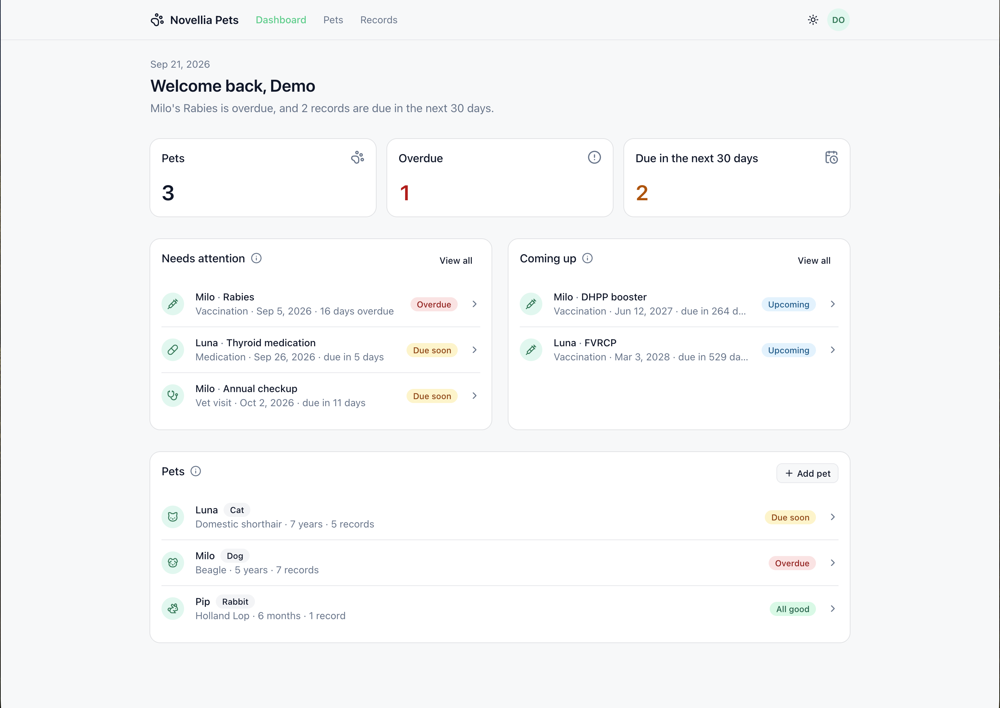
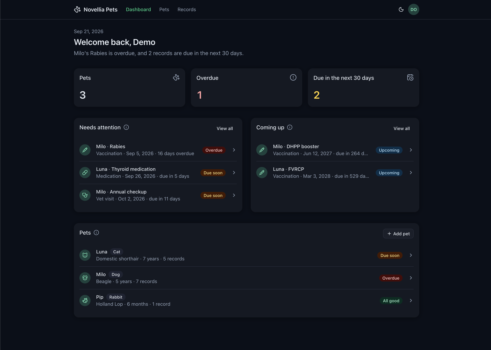
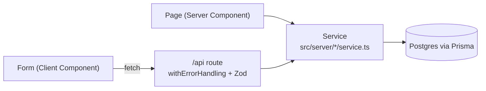
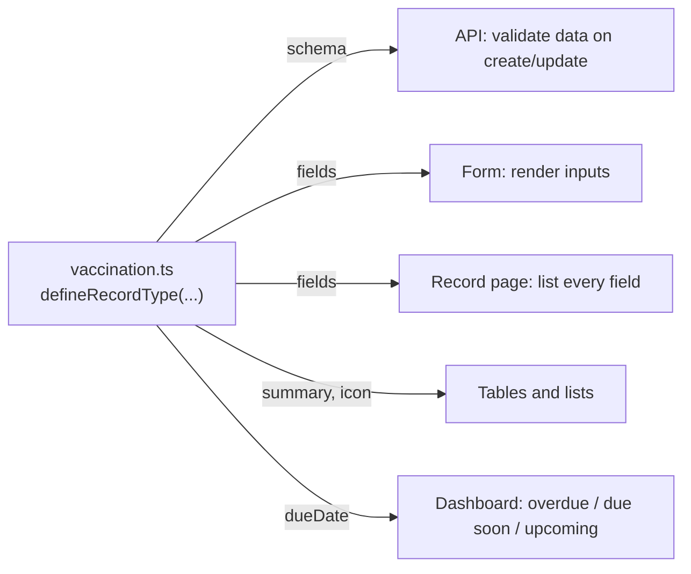

# Novellia Pets

**Walkthrough (under 10 minutes):** https://www.loom.com/share/1cd1e9c50b444faca83a3d81e365e145

An MVP for pet owners to track their pets and their pets' medical records. Records that imply future care (a next vaccine dose, a medication refill) carry a due date, and the app turns those into a dashboard of what is overdue, what is due soon, and what is coming up.

**Stack:** Next.js 16 (App Router) · React 19 · TypeScript · Tailwind 4 + shadcn/ui · Prisma 7 · PostgreSQL 16 · Zod · Vitest

<p align="center">
  
  
</p>

## Run it

The only requirement is Docker.

```sh
make up          # builds the app, starts Postgres, migrates, seeds demo data, serves on http://localhost:3000
make down        # stops everything
```

The app uses port 3000 and Postgres uses 5432 on the host; stop anything else on those ports first (a running `next dev`, a local Postgres). Without `make`, the same thing is `docker compose up --build`.

For development (app on the host with hot reload, Postgres in Docker), you also need Node 22:

```sh
make dev         # creates .env, starts Postgres, runs `next dev`
make seed        # (re)loads the demo data
make check       # lint + typecheck + format check + tests
make help        # everything else
```

## A two-minute tour

The demo data has three pets in three states. On the dashboard, the greeting says what needs doing; Milo has an overdue rabies vaccine, Luna has a refill due soon, and Pip is all good. Click the **Overdue** card: that is the Records page filtered to what the card counts, and the filters above the table are just URL parameters. Open **Milo**, then his overdue **Rabies** record: every field on that page comes from the vaccination type's definition, not from a hand-written screen.

Now add a record for Milo: pick **Vaccination**, give it a title and a **next dose due** date a week from now, and save. Back on the dashboard it appears under Needs attention with a "Due soon" badge, and Milo's status changes with it. That derived due date is the feature: records are history, and the app turns them into what to do next.

## What it does

- Add, view, edit and delete pets, each with a detail page listing their records.
- Add, view, edit and delete medical records. Four record types ship: vaccination, medication, vet visit, allergy. Each record has a detail page that renders every field its type defines.
- A dashboard with a one-line summary of the state of things, counts of overdue and due-soon care, the records that need attention, what is coming up, and every pet with its most urgent status.
- A records page across all pets, filterable by how soon a record is due (needs attention, overdue, due soon, upcoming), by type, and by title. The dashboard's lists link into it pre-filtered.
- Search pets by name or breed; search and filter a pet's own records by title and type.
- Light and dark themes, following the system by default with a toggle in the header.

### The feature: care tracking

The brief asked for one feature that would make the app genuinely useful, and for the reasoning behind it. Mine is that **records know when they are due**, and the app is organised around that.

A medical record on its own is history. What a pet owner actually needs to know is what to do next: the booster that is due in three weeks, the refill that ran out last Tuesday. So each record type can declare a rule for when it implies future care (`dueDate` in the registry, e.g. a vaccination's `nextDueDate`), the server stores the result as a real indexed column on the record, and everything visible is built on it: the dashboard's counts and lists, the status badge on every pet and record, the greeting sentence, and the "needs attention" filter on the records page. Adding a new record type with a due-date rule plugs into all of that with no extra work.

I chose it over alternatives like reminders or sharing with a vet because it is the smallest thing that changes the app from a filing cabinet into something you would open on purpose, and because it is a data-model decision (a derived, promoted column) rather than a feature bolted on top, which is the kind of decision this project is meant to show.

## How it is put together

```
src/
  app/            Next.js routes. Pages are Server Components that read via services;
                  app/api/** are thin REST handlers that validate and call services.
  server/         Everything that touches the database: Prisma client, services
                  (pets, records) and the dashboard read model, the due-date windows,
                  typed errors, the auth seam (currentUser), the theme cookie.
  shared/         Code used by both server and client: Zod input schemas, the
                  record-type registry, and the care rules (what "overdue" means).
  components/     React components. section-card.tsx is the frame every block of
                  content uses; shadcn/ui primitives live under components/ui.
  lib/            Small helpers used anywhere (API fetch wrapper, date formatting).
prisma/           Schema, migrations, seed.
```

The dependency direction is `app → server → shared`, and `components → shared`. Nothing in `shared` imports from `server` or `app`.

Reads and writes take different paths to the same service layer. A page is a Server Component, so it calls the service directly; a form runs in the browser, so it goes through the REST API, which validates and then calls the same service. The service is the one place that knows about the database and about ownership.



A few conventions, so the code reads the same everywhere: functions are `const name = () => {}`; `Pet` and `MedicalRecord` are the app's shapes (dates as `YYYY-MM-DD` strings) and Prisma's row types only appear inside `src/server/*/service.ts` as `PetRow` / `MedicalRecordRow`; lookups are plain objects typed `Partial<Record<string, T>>` rather than `Map`; list pages are for finding and opening things and only detail pages have Edit and Delete; and every filter lives in the URL, so results are linkable and server-rendered.

### The record-type registry

`src/shared/recordTypes/` is the single source of truth for what a record type is. Each type is one file with two things: a Zod schema that validates the record's `data`, and a list of form fields that says how to render it.

```ts
export const vaccination = defineRecordType({
  key: "vaccination",
  label: "Vaccination",
  pluralLabel: "Vaccinations",
  description: "A vaccine dose administered, with when the next one is due.",
  icon: SyringeIcon, // optional; lists show a generic document icon otherwise

  schema: z.strictObject({
    vaccine: z.string().trim().min(1, "Required"),
    nextDueDate: optionalIsoDate,
  }),

  fields: [
    { name: "vaccine", label: "Vaccine", kind: "text", required: true },
    { name: "nextDueDate", label: "Next dose due", kind: "date" },
  ],

  dueDate: (data) => data.nextDueDate ?? null,
  summary: (data) => data.vaccine,
});
```

The API validates incoming `data` with `schema`, the form renders inputs from `fields`, the record's detail page lists every field with its label, the tables show `summary` and `icon`, and the dashboard uses `dueDate`. None of those places mention a specific type. A test checks that every type's `fields` and `schema` list the same keys, so they cannot drift.



**To add a record type:** copy the closest file in `src/shared/recordTypes/`, edit it, and add it to the list in `index.ts`. No migration, route or component changes.

### Data model

- `User` → `Pet` → `MedicalRecord`, with cascading deletes.
- `MedicalRecord` keeps the fields every record shares (`type`, `title`, `date`, `notes`) as real columns and the type-specific fields in a `data` jsonb column validated by the registry. `dueDate` is derived from `data` on every write so the dashboard can query it with an index instead of unpacking JSON.
- `Pet.species` is a database enum (a closed set); `MedicalRecord.type` is a string keyed into the registry (an open set).

See [DECISIONS.md](DECISIONS.md) for the reasoning behind these and other choices, and what I would do differently.

## API

All routes act as a single demo owner (see "Authentication" in DECISIONS.md).

| Method             | Path                                 |                                 |
| ------------------ | ------------------------------------ | ------------------------------- |
| GET, POST          | `/api/pets`                          | list (`?q=`) / create           |
| GET, PATCH, DELETE | `/api/pets/:petId`                   | read / partial update / delete  |
| GET, POST          | `/api/pets/:petId/records`           | list (`?type=`, `?q=`) / create |
| GET, PATCH, DELETE | `/api/pets/:petId/records/:recordId` | read / partial update / delete  |

Validation errors return `400 { error, issues: [{ path, message }] }`; unknown ids return `404`.

For example, with the app running (`PET_ID` from any pet's URL):

```sh
# Create a vaccination with a next-due date; the response includes the derived dueDate.
curl -s -X POST localhost:3000/api/pets/$PET_ID/records \
  -H 'content-type: application/json' \
  -d '{"type":"vaccination","title":"Rabies","date":"2026-09-21","data":{"vaccine":"Rabies","nextDueDate":"2027-09-21"}}'

# Send an invalid date and get the field-level error the form shows.
curl -s -X PATCH localhost:3000/api/pets/$PET_ID/records/$RECORD_ID \
  -H 'content-type: application/json' \
  -d '{"date":"tomorrow"}'
# → 400 {"error":"Validation failed","issues":[{"path":["date"],"message":"Expected YYYY-MM-DD"}]}
```

## Tools and AI usage

**Stack choices.** Next.js, React and TypeScript are what I know best, so the UI and API layers are on familiar ground. Prisma and Postgres were new to me; I chose them because Postgres is what the team runs in production, and Prisma keeps the learning surface small (one schema file, generated types, a handful of query methods). The ORM was the right trade: the interesting decisions in this project are about the data model and the registry, not about SQL syntax. Tailwind and shadcn/ui are for speed; the components are copied into the repo, not imported from a package, so there is nothing hidden.

**AI.** I built this with Claude as a pair, working in small steps: I set the architecture direction and the constraints (extensible record types, thin API over services, no dependencies without a reason), it drafted code and explained the trade-offs, and I reviewed each change, ran it, and pushed back where the code was cleverer than it needed to be (several commits are readability passes that came out of that). Every decision in DECISIONS.md is one I can defend without the tool. The commit history is the honest record of how the project was built.

## Tests

`npm test` (or `make check` for the whole gate) runs unit tests for the pure logic: the record-type registry and schema derivation, input schemas, and the care-status rules. Manual API checks are in the commit history; there are no database integration tests (see DECISIONS.md).
